# Proyecto integrador

En este archivo, presentaré tanto el código empleado para abordar los ejercicios propuestos en el proyecto integrador, como las evidencias de las actividades realizadas a lo largo del proyecto.

Las instrucciones del proyecto vienen especificadas [aquí](./README.md).


## HDFS

En esta primera parte del proyecto, se trata de convertir los archivos que se encuentran dentro de la carpeta *[Datasets](#datasets)* en archivos HDFS. 

1.- Ejecutamos el archivo [docker-compose-v1.yml](Docker-compose/docker-compose-v1.yml)

```bash
sudo docker-compose -f docker-compose-v1.yml up -d
```

2.- Entramos al contenedor namenode:

```bash
sudo docker exec -it namenode bash
```

Luego dentro del contenedor creamos la carpeta data

```bash
mkdir data
exit // nos salimos del contenedor
```

3.- Desde fuera del contenedor, hacemos una copia de los archivos en la carpeta [Datasets](Datasets) y los copiamos al contenedor namenode.

```bash
sudo docker cp . namenode:/home/data
```

4.- Entramos al contenedor namenode:

```bash
sudo docker exec -it namenode bash
```

5.- Creamos la carpeta en HDFS `data` y colocamos los archivos dentro de la carpeta de `data`.

```bash
hdfs dfs -mkdir -p /data
hdfs dfs -put /home/data/* /data
```
El número de réplicas se puede visualizar en la siguiente imagen:

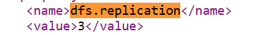

El tamaño de bloque se puede observar en la siguiente imagen: 

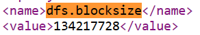

## HIVE

Para esta actividad, se utiliza el archivo `docker-compose-v2.yml`.

```bash
sudo docker-compose -f docker-compose-v2.yml up -d
```

A partir de los archivos HDFS creados en el punto anterior, se van a crear las tablas en HIVE.

1.- Para entrar en el contenedor `hive-server`, ejecuta el siguiente comando:

```bash
sudo docker exec -it hive-server bash
```

2.- Ejecutamos el script `Paso02.hql` con el siguiente comando:

```bash
hive -f scripts/Paso02.hql
```
Esto creará nuestras tablas en HIVE.

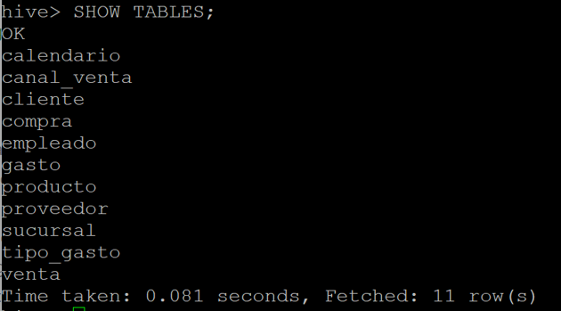

## Formatos de almacenamiento

Se van a crear tablas en HIVE utilizando archivos en formato Parquet en lugar de archivos CSV. Continuaremos utilizando los contenedores del `docker-compose-v2.yml`, y la fuente de los datos utilizaremos los datos del [Datasets2](Parquet/Datasets2).

1.- Entramos al contenedor namenode:

```bash
sudo docker exec -it namenode bash
```

Luego dentro del contenedor creamos la carpeta data

```bash
mkdir data2
exit // nos salimos del contenedor
```

2.- Desde fuera del contenedor, hacemos una copia de los archivos en la carpeta [Datasets2](Parquet/Datasets2) y los copiamos al contenedor namenode.

```bash
sudo docker cp . namenode:/home/data2
```

3.- Entramos al contenedor namenode:

```bash
sudo docker exec -it namenode bash
```

4.- Creamos la carpeta en HDFS `data2` y colocamos los archivos dentro de la carpeta de `data2`.

```bash
hdfs dfs -mkdir -p /data2
hdfs dfs -put /home/data2/* /data2
```

5.- Ejecutamos el script `Paso03.hql` con el siguiente comando:

```bash
hive -f scripts/Paso03.hql
```
Esto creará nuestras tablas en HIVE a partir de un archivo que contiene datos en formato Parquet.

6.- Crearemos particiones anuales de la tabla `venta` y aplicaremos un filtro para hacer comparaciones en el tiempo de consulta entre una tabla sin particionar y una tabla particionada.


La tabla sin particionar toma 0.436 segundos en realizar la consulta: `SELECT * FROM venta WHERE year(Fecha) = 2015`.

7.- Creamos la tabla `venta_part` en HIVE con la siguiente estructura:

```sql
CREATE TABLE venta_part (
  idventa STRING,
  fecha STRING,
  fecha_entrega STRING,
  idcanal STRING,
  idcliente STRING,
  idsucursal STRING,
  idempleado STRING,
  idproducto STRING,
  precio STRING,
  cantidad STRING
)
PARTITIONED BY (anio INT)
STORED AS PARQUET;

INSERT OVERWRITE TABLE venta_part PARTITION (anio=2015) SELECT * FROM venta WHERE year(fecha) = 2015;
```

La tabla particionada toma 0.434 segundos en realizar la consulta: `SELECT * FROM venta WHERE year(Fecha) = 2015`.


Hemos observado una mejora  en el tiempo de ejecución de las consultas cuando utilizamos una tabla particionada en comparación con una tabla no particionada.


## Indices

Vamos a crear índices en nuestras tablas creadas con HIVE para realizar comparativas de tiempo de ejecución.

1.-Para realizar la comparativa, creamos la siguiente consulta:

La consulta realiza una comparativa entre las ventas, compras y gastos para los años 2019 y 2020.

```sql
SELECT
    v.ano AS ano,
    v.mes AS mes,
    v.Ventas AS Ventas,
    c.Compras AS compras,
    g.Gastos AS Gasto,
    v.Ventas - c.Compras - g.Gastos AS Ingreso
FROM (
    SELECT
        YEAR(Fecha) AS ano,
        MONTH(Fecha) AS mes,
        SUM(Precio * Cantidad) AS Ventas
    FROM venta
    WHERE YEAR(Fecha) BETWEEN 2019 AND 2020
    GROUP BY YEAR(Fecha), MONTH(Fecha)
) v
JOIN (
    SELECT
        YEAR(Fecha) AS ano,
        MONTH(Fecha) AS mes,
        SUM(Precio * Cantidad) AS Compras
    FROM compra
    WHERE YEAR(Fecha) BETWEEN 2019 AND 2020
    GROUP BY YEAR(Fecha), MONTH(Fecha)
) c ON (v.mes = c.mes AND v.ano = c.ano)
JOIN (
    SELECT
        YEAR(Fecha) AS ano,
        MONTH(Fecha) AS mes,
        SUM(Monto) AS Gastos
    FROM gasto
    WHERE YEAR(Fecha) BETWEEN 2019 AND 2020
    GROUP BY YEAR(Fecha), MONTH(Fecha)
) g ON (v.mes = g.mes AND v.ano = g.ano)
ORDER BY mes
LIMIT 5;
 ```

El tiempo de ejecución de la consulta fue de 21.959 segundos.


2.- Creación del índice

Hive no permite la creación de un índice en una columna tipo fecha debido al tipo de consulta. Los filtros se realizan con el año, por lo que agregaremos una nueva columna "ano". Dado que Hive no permite agregar columnas fácilmente, creamos una nueva tabla.

Primero, creamos una nueva tabla llamada `nueva_venta` con una columna adicional "ano" de la siguiente manera:

```sql
/*Creación Tabla */
CREATE TABLE nueva_venta AS
SELECT *, YEAR(fecha) AS ano
FROM venta;

/*Creación indice */

CREATE INDEX idx_venta_ano ON TABLE nueva_venta (ano)
AS 'org.apache.hadoop.hive.ql.index.compact.CompactIndexHandler'
WITH DEFERRED REBUILD;
```

El tiempo de ejecución de la consulta fue de 19.534 segundos.


La creación de índices en nuestras tablas ha demostrado una  mejora en el tiempo de ejecución de las consultas en comparación con las tablas sin índices. 

## No-SQL

Para esta sección, utilizaremos el entorno proporcionado por [docker-compose-v3](Docker-compose/docker-compose-v3.yml).

```bash
sudo docker-compose -f docker-compose-v3.yml up -d
```

### 1) HBase

1.- Entramos en el shell de HBase en el contenedor `hbase-master`, con el siguiente comando:

```bash
sudo docker exec -it hbase-master hbase shell
```

2.- Creamos una tabla en HBase llamada 'personal' y agregamos información personal para varias personas en forma de filas y columnas.

```bash
create 'personal','personal_data'
put 'personal',1,'personal_data:name','Juan'
put 'personal',1,'personal_data:city','Córdoba'
put 'personal',1,'personal_data:age','25'
put 'personal',2,'personal_data:name','Franco'
put 'personal',2,'personal_data:city','Lima'
put 'personal',2,'personal_data:age','32'
put 'personal',3,'personal_data:name','Ivan'
put 'personal',3,'personal_data:age','34'
put 'personal',4,'personal_data:name','Eliecer'
put 'personal',4,'personal_data:city','Caracas'
get 'personal','4'
```

La última línea de comando, 'get 'personal','4'', nos permite obtener la información de la persona con el identificador '4' en la tabla 'personal' de HBase.

3.- Salimos del shell de HBase y entramos al  bash del contenedor `hbase-master` con el siguiente comando:

```bash
sudo docker exec -it hbase-master hbase bash
```

Para crear una tabla en HBase a partir del archivo [personal.csv](Datasets/personal.csv), utilizar la siguiente linea de codigo:

```bash
hbase org.apache.hadoop.hbase.mapreduce.ImportTsv -Dimporttsv.separator=',' -Dimporttsv.columns=HBASE_ROW_KEY,personal_data:name,personal_data:city,personal_data:age personal hdfs://namenode:9000/data/personal.csv
```
Nota: Asegúrate de que la ubicación del archivo sea la correcta y que esté en HDFS. Esto se crea en la sección de HDFS.

4.- Ingresa nuevamente al shell de HBase. Una vez dentro del shell de HBase, verifica que la tabla se ha cargado correctamente ejecutando el siguiente comando:

```bash
scan 'personal'
```


En la imagen se puede apreciar que la carga de datos se realizó correctamente.

5.- Creamamos otra tabla llamada 'album' y le cargamos valores de etiqueta de la siguiente manera:

```bash
create 'album','label','image'
    put 'album','label1','label:size','10'
    put 'album','label1','label:color','255:255:255'
    put 'album','label1','label:text','Family album'
    put 'album','label1','image:name','holiday'
    put 'album','label1','image:source','/tmp/pic1.jpg'
```

```bash
get 'album','label1'
```


### 2) MongoDB

1.- Copiar los archivos [iris.csv](Datasets\iris.csv) y [iris.json](Datasets\iris.json) al contenedor de `MongoDB` 

```bash
sudo docker cp iris.csv mongodb:/iris.csv
sudo docker cp iris.json mongodb:/iris.json
```

2.- Entrar al contenedor de `MongoDB`
```bash
sudo docker exec -it mongodb bash
```

3.- Importamos los archivos 'iris.csv' y 'iris.json' en MongoDB

```bash
mongoimport /iris.csv --type csv --headerline -d dataprueba -c iris_csv

mongoimport --db dataprueba --collection iris_json --file /iris.json --jsonArray
```

4.- Ingresar a la consola de MongoDB dentro del contenedor `MongoDB`

```bash
mongosh
```

5.- Verificar que los archivos se hayan importado correctamente, mediante consultas en la consola de MongoDB.

```bash
use dataprueba
show collections
db.iris_csv.find()
db.iris_json.find()
```
.png)

.png)

En las imágenes se puede observar que los archivos se importaron correctamente. Los resultados de las consultas 'iris_csvs.find()' e 'iris_json.find()' muestran datos disponibles en las colecciones 'iris_csv' e 'iris_json' de MongoDB.

6.- Realizar la exportación de las colecciones

```bash
mongoexport --db dataprueba --collection iris_csv --fields sepal_length,sepal_width,petal_length,petal_width,species --type=csv --out /iris_export.csv

mongoexport --db dataprueba --collection iris_json --fields sepal_length,sepal_width,petal_length,petal_width,species --type=json --out /iris_export.json
```
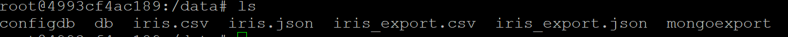


### 3) Neo4j

1.- Entrar al contenedor `Neo4j`

```bash
sudo docker exec -it Neo4j bash
```

2.- Crear el grafo 

```bash

CREATE 
(a:Location {name: 'A'}),
(b:Location {name: 'B'}),
(c:Location {name: 'C'}),
(d:Location {name: 'D'}),
(e:Location {name: 'E'}),
(f:Location {name: 'F'}),
(a)-[:ROAD {cost: 50}]->(b),
(b)-[:ROAD {cost: 50}]->(a),
(a)-[:ROAD {cost: 50}]->(c),
(c)-[:ROAD {cost: 50}]->(a),
(a)-[:ROAD {cost: 100}]->(d),
(d)-[:ROAD {cost: 100}]->(a),
(b)-[:ROAD {cost: 40}]->(d),
(d)-[:ROAD {cost: 40}]->(b),
(c)-[:ROAD {cost: 40}]->(d),
(d)-[:ROAD {cost: 40}]->(c),
(c)-[:ROAD {cost: 80}]->(e),
(e)-[:ROAD {cost: 80}]->(c),
(d)-[:ROAD {cost: 30}]->(e),
(e)-[:ROAD {cost: 30}]->(d),
(d)-[:ROAD {cost: 80}]->(f),
(f)-[:ROAD {cost: 80}]->(d),
(e)-[:ROAD {cost: 40}]->(f),
(f)-[:ROAD {cost: 40}]->(e);
```

2.- Verificar si el grafo se ha creado correctamente.

```cypher
MATCH (l:Location)
RETURN l
```
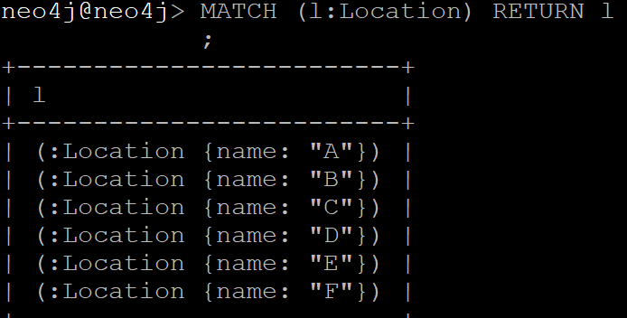

De manera gráfica, se puede observar la relación entre los nodos

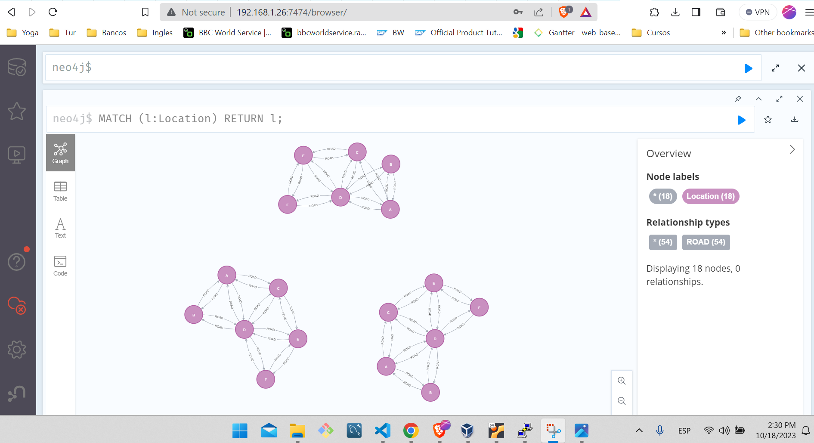

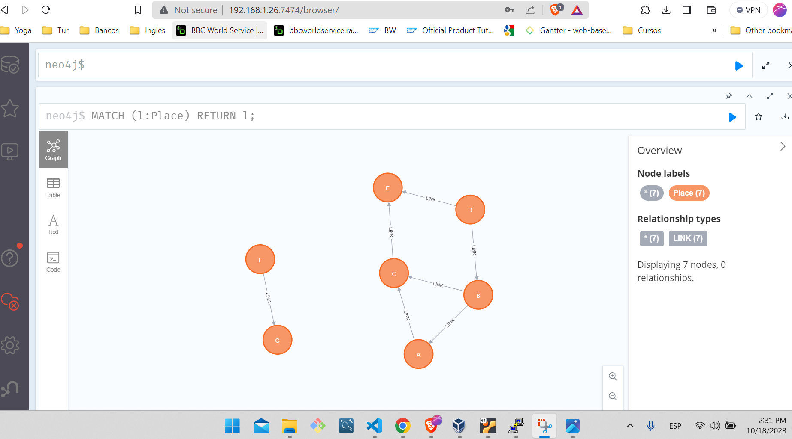


3.- Realizar una búsqueda de la ruta más corta entre dos nodos en un grafo utilizando el algoritmo de Dijkstra. En este caso, se busca la ruta más corta desde el nodo 'A' hacia el nodo 'E'. En Neo4j, puedes hacer esto con la siguiente consulta Cypher:

```cypher
MATCH (source:Location {name: 'A'}), (target:Location {name: 'E'})
CALL gds.shortestPath.dijkstra.stream('miGrafo', {
    sourceNode: source,
    targetNode: target,
    relationshipWeightProperty: 'cost'
})
YIELD sourceNode, targetNode, distance
RETURN sourceNode.name AS sourceName, targetNode.name AS targetName, distance
```

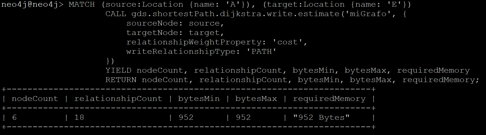


4.- Realizar una consulta para encontrar la ruta más corta desde el nodo 'A' al nodo 'E' en un grafo, que incluya los nombres de los nodos en la ruta y el costo total.

```cypher
MATCH (source:Location {name: 'A'}), (target:Location {name: 'E'})
CALL gds.shortestPath.dijkstra.stream('miGrafo', {
    sourceNode: source,
    targetNode: target,
    relationshipWeightProperty: 'cost'
})
YIELD index, sourceNode, targetNode, totalCost, nodeIds, costs, path
RETURN
    index,
    gds.util.asNode(sourceNode).name AS sourceNodeName,
    gds.util.asNode(targetNode).name AS targetNodeName,
    totalCost,
    [nodeId IN nodeIds | gds.util.asNode(nodeId).name] AS nodeNames,
    costs,
    nodes(path) as path
ORDER BY index
```
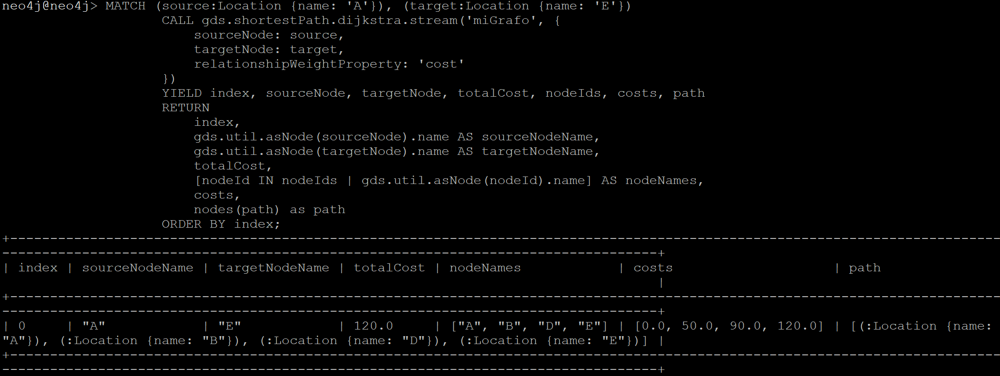

5) Crear los grafos a partir de los archivos [producto.csv](Datasets/producto/Producto.csv), [cliente.csv](Datasets/cliente/Cliente.csv) y [venta.csv](Datasets/venta/Venta.csv)

 a) Copiar los archivos al contenedor `Neo4j` desde fuera del contenedor

```bash
sudo docker cp producto.csv neo4j:/var/lib/neo4j/import/producto.csv
sudo docker cp cliente.csv neo4j:/var/lib/neo4j/import/cliente.csv
sudo docker cp venta.csv neo4j:/var/lib/neo4j/import/venta.csv
```

b) Entrar al contenedor `Neo4j`

```bash
sudo docker exec -it Neo4j bash
```
c) Crear los grafos en Neo4j a partir de los archivos 'producto.csv', 'cliente.csv' y 'venta.csv',

```cypher
LOAD CSV WITH HEADERS FROM "file:///producto.csv" AS row
CREATE (n:Producto)
SET n = row,
n.IdProducto = toInteger(row.IdProducto),
n.Producto = toString(row.Producto), 
n.IdTipoProducto = toInteger(row.IdTipoProducto);


LOAD CSV WITH HEADERS FROM "file:///cliente.csv" AS row
CREATE (n:Cliente)
SET n = row,
n.IdCliente = toInteger(row.IdCliente),
n.Nombre_y_Apellido = toString(row.Nombre_y_Apellido),
n.Domicilio = toString(row.Domicilio);

LOAD CSV WITH HEADERS FROM "file:///venta.csv" AS row
CREATE (n:Venta)
SET n = row,
n.IdVenta = toInteger(row.IdVenta),
n.IdCliente = toInteger(row.IdCliente),
n.IdProducto = toInteger(row.IdProducto),
n.Precio = toFloat(row.Precio),
n.Cantidad = toInteger(row.Cantidad);
```

Tabla de clientes
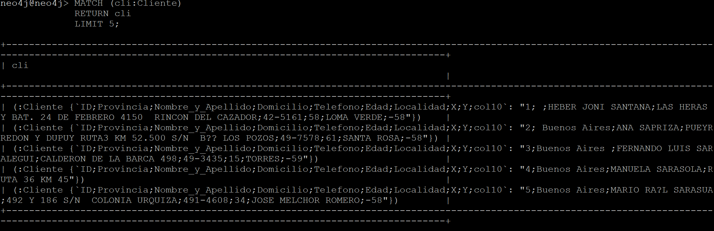

Tabla de productos
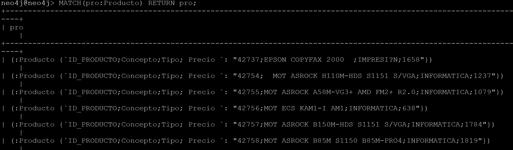

Tabla ventas
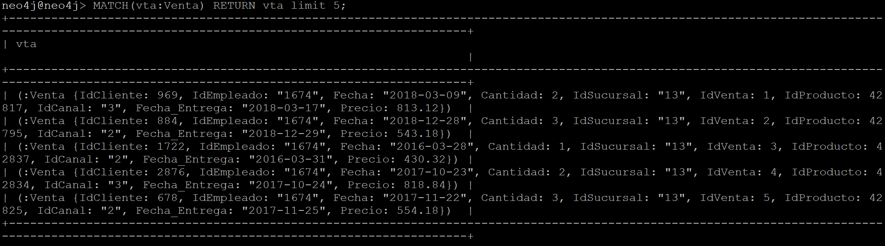

d) Realizar las siguientes consultas

```cypher
MATCH(pro:Producto) RETURN pro;
MATCH(cli:Cliente) RETURN cli;
MATCH(tp:TipoProducto) RETURN tp;
MATCH(vta:Venta) RETURN vta;

CREATE INDEX ON :Producto(IdProducto);
CREATE INDEX ON :TipoProducto(IdTipoProducto);
CREATE INDEX ON :Cliente(IdCliente);
CREATE INDEX ON :Venta(IdVenta);

MATCH (t:TipoProducto),(p:Producto)
WHERE t.IdTipoProducto = p.IdTipoProducto
CREATE (t)-[:AGRUPA_A]->(p);

MATCH (p:Producto),(v:Venta)
WHERE p.IdProducto = v.IdProducto
CREATE (p)-[:VENDIDO_EN]->(v);

MATCH (c:Cliente),(v:Venta)
WHERE c.IdCliente = v.IdCliente
CREATE (c)-[:CLIENTE_EN]->(v);
```

## 6) Spark

Se pueden utilizar los entornos [docker-compose-v4.yml](Docker-compose\docker-compose-v4.yml) y [docker-compose-kafka.yml](Docker-compose\docker-compose-kafka.yml)

```bash
sudo docker-compose -f docker-compose-v4.yml up -d
sudo docker-compose -f docker-compose-kafka.yml up -d
```

1. Acceder al contenedor de Spark llamado `spark-master` y ejecuta el entorno PySpark.

```
docker exec -it spark-master bash
/spark/bin/pyspark --master spark://spark-master:7077
```

2.- Cargar raw-flight-data.csv desde HDFS.

```
from pyspark.sql.types import *

flightSchema = StructType([
StructField("DayofMonth", IntegerType(), False),
StructField("DayOfWeek", IntegerType(), False),
StructField("Carrier", StringType(), False),
StructField("OriginAirportID", IntegerType(), False),
StructField("DestAirportID", IntegerType(), False),
StructField("DepDelay", IntegerType(), False),
StructField("ArrDelay", IntegerType(), False),
]);

flights = spark.read.csv('hdfs://namenode:9000/data/flights
raw-flight-data.csv', schema=flightSchema, header=True)
  
flights.show()
flights.describe()
```

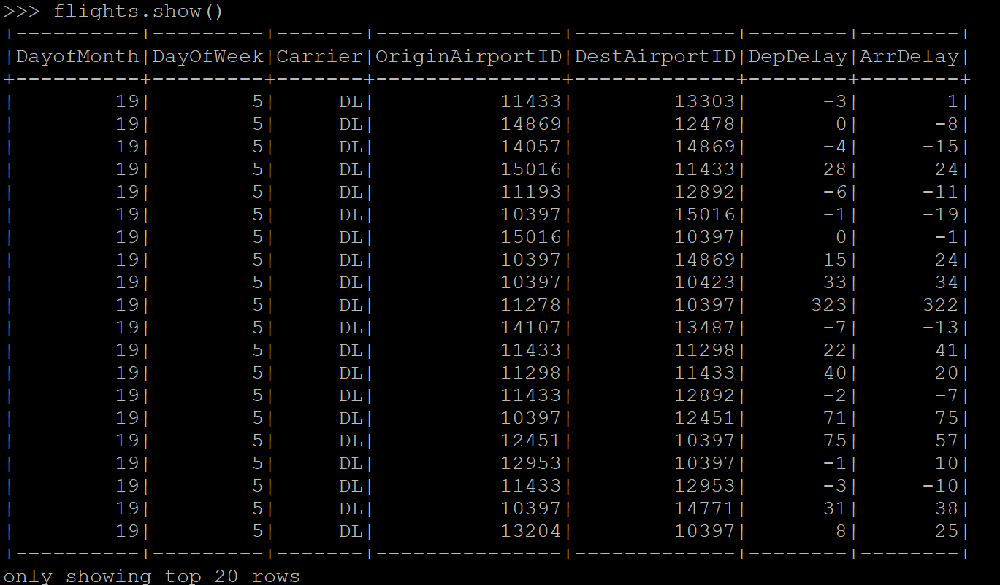
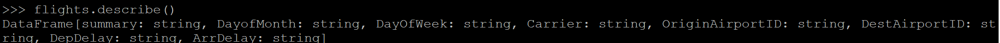

3.- Ubicarse en la línea de comandos del Spark master y comenzar Scala.
```
docker exec -it spark-master bash
spark/bin/spark-shell --master spark://spark-master:7077
```

4.- Cargar raw-flight-data.csv desde HDFS

```
case class flightSchema(DayofMonth:String, DayOfWeek:String, Carrier:String, OriginAirportID:String, DestAirportID:String, DepDelay:String, ArrDelay:String)
val flights = spark.read.format("csv").option("sep", ",").option("header", "true").load("hdfs://namenode:9000/data/flights/raw-flight-data.csv").as[flightSchema]

flights.show()
```


### ETL con SPARK

A partir de la tabla venta, realizar el proceso de filtrado de valores outliers utilizando Spark.

1.- Entrar a Spark

```
sudo docker exec -it spark-master bash
/spark/bin/pyspark --master spark://spark-master:7077
```

2.-Importar los modulos

```
from pyspark.sql import *
from pyspark.sql.types import *
from pyspark.sql.functions import *
```

3.- Leer la tabla venta

```
venta = spark.read.option("compression.codec", "snappy").option("mergeSchema", "true").parquet("hdfs://namenode:9000/data2/venta")
```

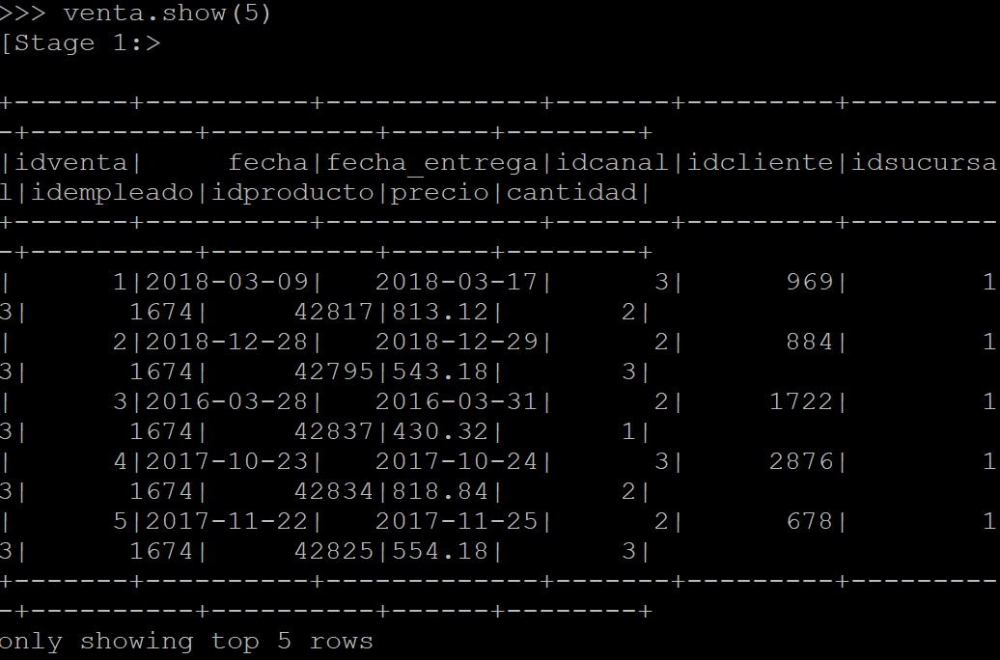


4.- Crear la tabla venta_out donde quitamos las columnas que tengan valores nulos
y calcular el promedio y desviacion estandar por IdProducto

```
ventas_out = venta.na.drop(subset=['precio','cantidad']).groupBy("idproducto").agg(mean(venta.precio).alias("promedio"), stddev(venta.precio).alias("stddev"))
```

5.- Agregar las columnas "PrecioMaximo" y "PrecioMinimo", donde "PrecioMaximo" representa el precio que se encuentra tres desviaciones estándar por encima del promedio, y "PrecioMinimo" representa el precio que se encuentra tres desviaciones estándar por debajo del promedio.


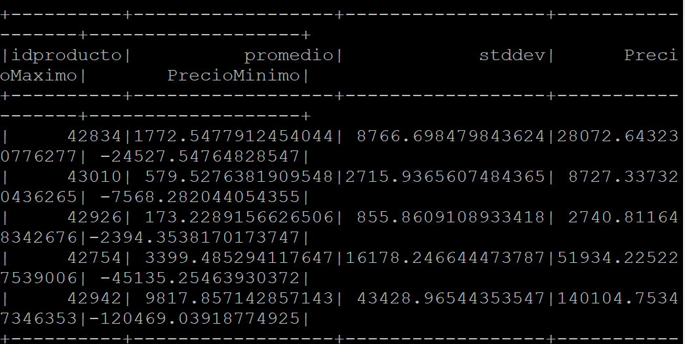


6.- Realizar un join entre las tablas venta y ventas_out para sacar el precio maximo y minimo por cada IdProducto

```
venta = venta.alias("v").join(ventas_out.alias("o"), venta['idproducto'] == ventas_out['idproducto']).select("v.idventa","v.fecha","v.fecha_entrega","v.idcanal","v.idcliente","v.idsucursal","v.idempleado","v.idproducto","v.precio","v.cantidad","o.promedio","o.stddev","o.PrecioMaximo","o.PrecioMinimo")
```

7.- Cambiar el tipo de dato de las columnas PrecioMaximo y PrecioMinimo

```
venta.withColumn("PrecioMaximo",col("PrecioMaximo").cast("float"))

venta.withColumn("PrecioMinimo",col("PrecioMinimo").cast("float"))
```

8.- Crear una función para determinar si un valor es atipico o no 

```
def detecta_outlier(valor, maximo, minimo):
    return (valor < minimo) or (valor > maximo)
```

9.- Crear una función, e devolvera True o False dependiendo si el valor es un outlier o no

```
udf_detecta_outlier = udf(lambda valor, MaxLimit, MinLimit: detecta_outlier(valor, MaxLimit, MinLimit), BooleanType())
```


10.- Eliminar las filas en las que los valores de precio o cantidad sean nulos

```
venta = venta.na.drop(subset=['precio','cantidad'])
```

11.- Finalmente filtrar la tabla venta , para solo dejar las filas que no sean outliers

```
venta = venta.withColumn("esOutlier", udf_detecta_outlier(venta.precio, venta.PrecioMaximo, venta.PrecioMinimo)).filter("NOT esOutlier")
```

12.- Mantenemos en la tabla venta solo las columnas que venían originalmente y descartamos las columnas que utilizamos de apoyo para filtrar los outliers

```
venta = venta.select(["idventa","fecha","fecha_entrega","idcanal","idcliente","idsucursal","idempleado","idproducto","precio","cantidad"])
```

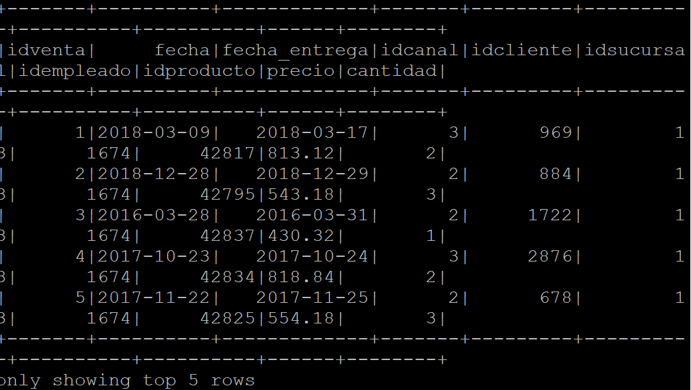

13.- Crear archivo parquet de la tabla venta sin outliers

```
venta.repartition(1).write.option("compression.codec", "snappy").option("mergeSchema", "true").parquet("hdfs://namenode:9000/data2/venta_sin_outliers", mode="overwrite")
```

14.- Crear un archivo parquet de la tabla_out , donde vienen los datos considerado outliers

```
ventas_out.repartition(1).write.option("compression.codec", "snappy").option("mergeSchema", "true").parquet("hdfs://namenode:9000/data2/venta_criterio_outliers", mode="overwrite")
```


## 7) Carga incremental con Spark

Actualizar la tabla "venta" con los datos generados mediante el script [Paso06_GeneracionVentasNuevasPorDia.py](scripts/Paso06_GeneracionVentasNuevasPorDia.py), el cual genera nuevos datos de manera aleatoria.

El script "Paso06_GeneracionVentasNuevasPorDia.py" utiliza los datasets proporcionados en la carpeta [Datasets/data_nvo](Datasets/data_nvo) para generar las novedades de forma automática.

1.- Copiar los scripts [Paso06_GeneracionVentasNuevasPorDia.py](scripts\Paso06_GeneracionVentasNuevasPorDia.py) y [Paso06_IncrementalVentas.py](scripts\Paso06_IncrementalVentas.py) dentro del contenedor `spark-master`

```
sudo docker cp Paso06_GeneracionVentasNuevasPorDia.py spark-master:/

sudo docker cp Paso06_IncrementalVentas.py spark-master:/

```

2.- Entrar a `spark-master` y acceder al spark

```	
sudo docker exec -it spark-master /spark/bin/spark-submit --master spark://spark-master:7077
```	

3.- Ejecutar los scripts

```	
execfile("Paso06_GeneracionVentasNuevasPorDia.py")
execfile("Paso06_IncrementalVentas.py")
```	
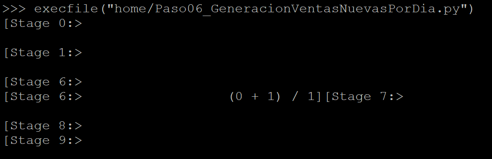

Esto genera tres tablas con datos nuevos:

- Una tabla de clientes.
- Una tabla de empleados.
- Una tabla de productos.

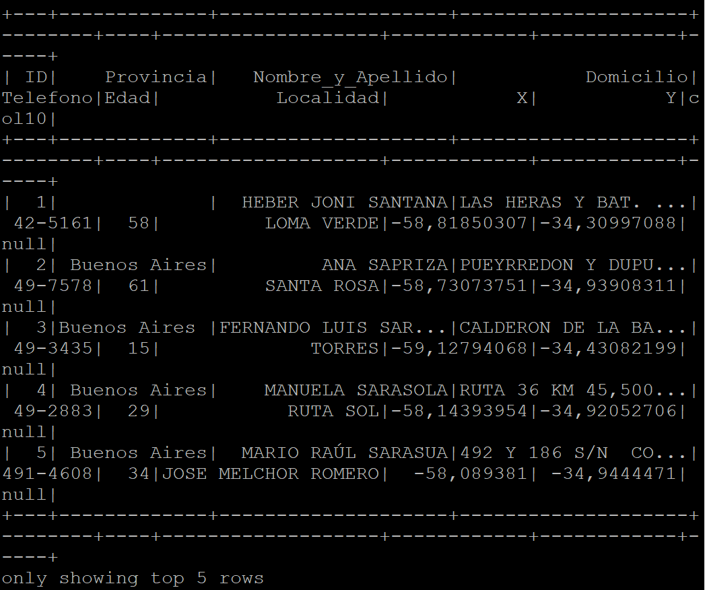

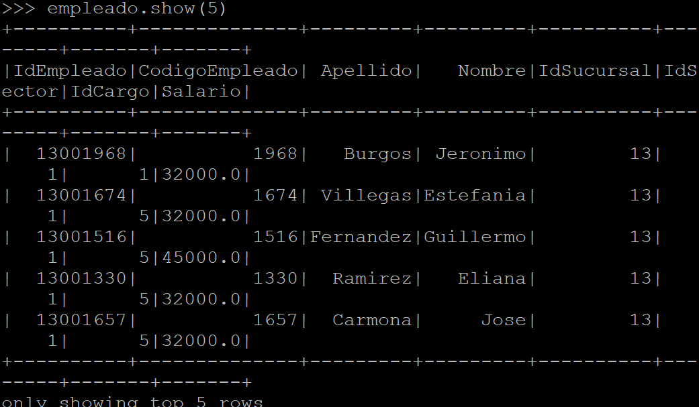

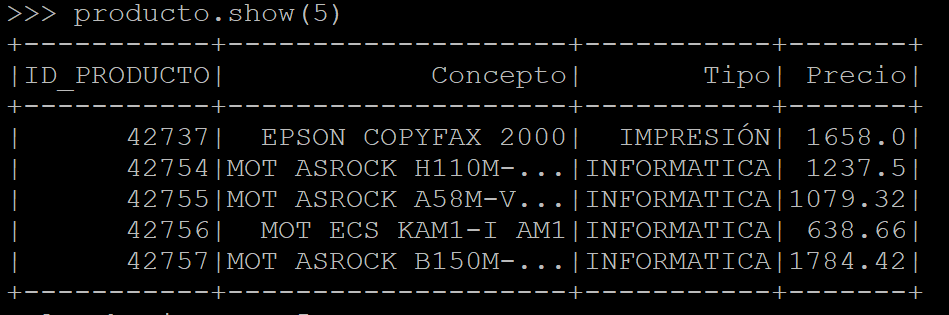

Además, el script también genera la tabla "venta_incremental", donde se anexan los nuevos datos generados a la tabla "venta" existente. Esta tabla contiene la información combinada de ventas anteriores y los nuevos datos. Esta tabla se encuentra en el namenode:/data2/venta_incremental

4.- Programar con crontab para que el script de [Paso06_IncrementalVentas.py](scripts\Paso06_IncrementalVentas.py) se ejecute a las 5 a.m. todos los días

Desde fuera del contenedor

```
crontab -e
0 5 * * * /spark/bin/spark-submit --master spark://spark-master:7077 scripts\Paso06_IncrementalVentas.py
```
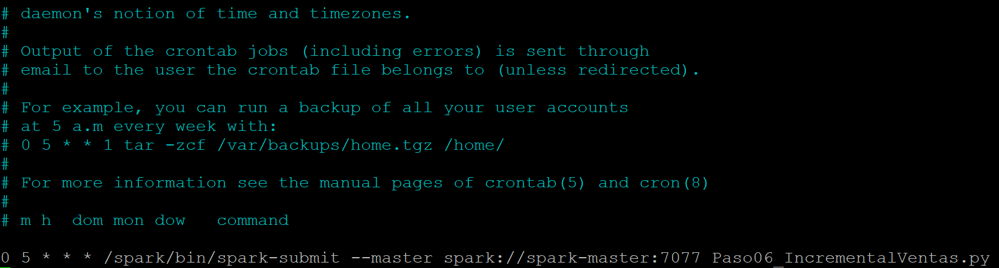


